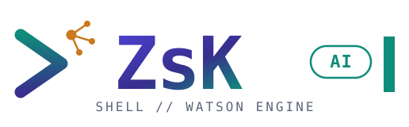
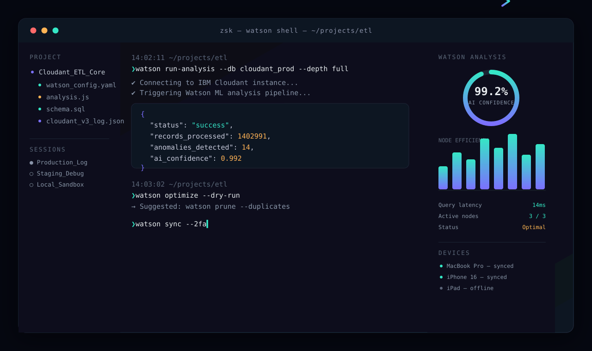

<br />
<p align="center">
  <a style="text-decoration: none;" href="https://zs-k-bot.vercel.app">
    <picture>
      <source media="(prefers-color-scheme: dark)" srcset="./assets/logo-dark.svg">
      
    </picture>
  </a>
</p>

    <a href="https://zs-k-bot.vercel.app">zs-k-bot.vercel.app →</a>
    <a href="https://zs-k-bot.vercel.app" target="_blank">→ https://zs-k-bot.vercel.app ←</a>
</p>
<p align="center">
  An AI-augmented terminal shell that thinks alongside you - synced, secure, and scriptable.
  <br />
  <br />
  <a href="https://github.com/clauderiks/ZsK-bot/releases"></a>
  <a href="./LICENSE"></a>
  <a href="https://github.com/clauderiks/ZsK-bot/stargazers"></a>
  <a href="https://github.com/clauderiks/ZsK-bot/issues"></a>
</p>

<br />

<p align="center">
  
</p>

## 🌟 Features

- Watson AI engine on top of Gemini — get command analysis, optimization hints, and anomaly detection inline, not in a separate chat window
- Cloudant-backed cloud sync for sessions, command history, and devices — pick up the same shell on your laptop, tablet, or phone
- Mandatory 2FA and AES-256-GCM session encryption, so a synced shell is never an open shell
- Real syntax highlighting for JS, SQL, YAML, JSON, Rust, and more — straight in the terminal output
- A real project tree in the sidebar, with a file viewer for anything you `cat`
- Built-in RFC / spec viewer so you don't have to alt-tab to read the standard you're implementing against
- One-click drawers for Google Docs, Tasks, Chat, and Forms, without leaving the shell
- Export any session to PDF, Markdown, or CSV for reports, hand-offs, or audits

If you want a shell that keeps up with you instead of the other way around — and you <strong>still live in the terminal</strong> — `ZsK AI` is for you. 🫵🏽

## 📃 Docs

`ZsK AI` has a docs site at [zsk.ai](https://zsk.ai).

## 🙏 Contributing

Found a bug or have an idea? Open an issue using the templates in [`.github/ISSUE_TEMPLATE`](./.github/ISSUE_TEMPLATE), or send a pull request — small, focused PRs are the easiest to review and merge.

1. Fork the repo
2. Create a feature branch (`git checkout -b feature/my-feature`)
3. Commit your changes (`git commit -m 'Add my feature'`)
4. Push the branch (`git push origin feature/my-feature`)
5. Open a Pull Request

## 🛞 Under the hood

`ZsK AI` uses:

- [React 19](https://react.dev) + [TypeScript](https://www.typescriptlang.org) for the UI
- [Vite 6](https://vitejs.dev) for the dev server and build
- [Tailwind CSS 4](https://tailwindcss.com) for styling
- [`@google/genai`](https://ai.google.dev) (Gemini) for the Watson AI engine
- [Firebase](https://firebase.google.com) for auth and Cloudant-backed sync
- [Recharts](https://recharts.org) for the analysis panel's charts
- [Motion](https://motion.dev) for interface animation
- [Lucide](https://lucide.dev) for icons
- [Express](https://expressjs.com) for the local/server runtime

## ⚙️ Getting started

```bash
git clone https://github.com/clauderiks/ZsK-bot.git
cd ZsK-bot
npm install
cp .env.example .env   # add your GEMINI_API_KEY
npm run dev
```

The shell runs at `http://localhost:3000`.

> ⚠️ Don't commit `.env` or any populated `firebase-applet-config.json` - treat both as secrets, even in a private fork.

## Authors

Built by the ZsK AI team and its [contributors](https://github.com/clauderiks/ZsK-bot/graphs/contributors).